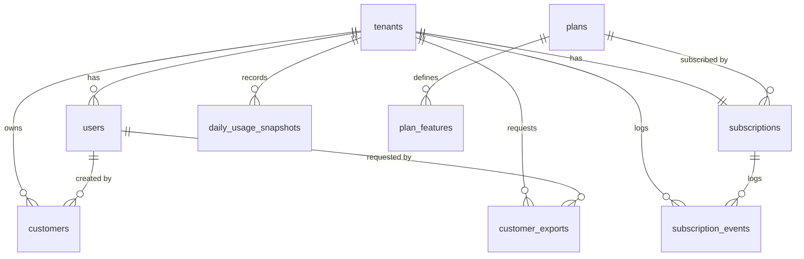

# Database

MySQL 8.4, InnoDB, `utf8mb4_unicode_ci`. All timestamps are UTC. Money is stored in cents as `INT UNSIGNED`, never as a float.

## Entity relationships



## Tables

**`tenants`.** One row per company. `status` is `active` or `suspended`, and `suspended_at` records when an admin suspended it. Tenants are never hard-deleted through the API.

**`users`.** Staff users of a company, plus platform admins. `tenant_id` is `NULL` only for platform admins, and `is_platform_admin` can never be set through the API. `is_active = false` blocks login. Soft deletes keep the row, and `email_active` keeps email unique among non-deleted users (see below).

**`plans`.** Free, Starter, and Pro. `code` is what clients send (`plan_code`). `price_cents = 0` makes a plan free. An inactive plan is hidden and cannot be chosen, but companies already on it keep it.

**`plan_features`.** One row per plan and feature. Quantity features (`max_users`, `max_customers`, `api_rate_per_minute`) use `limit_value`, where `NULL` means unlimited. On/off features (`customer_export`, `analytics_trends`) use `is_enabled`. A missing row means the feature is off. A table was chosen over a JSON column because each feature is a typed row, the unique key stops duplicates, and an admin can change one limit without rewriting a blob.

**`subscriptions`.** Exactly one row per company (`UNIQUE (tenant_id)`). It holds the current plan, the status, and the trial, period, and cancellation dates. A plan change updates this row.

**`subscription_events`.** Append-only history: one row for every subscription change, with the status and plan before and after. It has `occurred_at` and no `updated_at`, and is never exposed by ID. The platform dashboard counts churn from it.

**`customers`.** The company's own clients. They never log in. `created_by_user_id` becomes `NULL` if that user is ever hard-deleted. Soft deletes and `email_active` work as on `users`, but email is unique per company, not across the platform.

**`customer_exports`.** One row per CSV export request. `filters` stores the list filters as JSON, so the file matches what the user saw. `file_path` points to the file on the `local` disk. `error_message` holds a safe message only, never a stack trace.

**`daily_usage_snapshots`.** One row per company per day, written by a scheduled job. The dashboard trend reads from it. `UNIQUE (tenant_id, snapshot_date)` also makes the job safe to run twice on the same day.

**Package tables.** spatie/laravel-permission adds `roles`, `permissions`, and three pivot tables, with teams mode on and `tenant_id` as the team column. The three roles are global rows, and the `model_has_roles` row carries the company, so one set of roles serves every company. Sanctum adds `personal_access_tokens`. Laravel's `password_reset_tokens` serves both forgot-password and new-user invitations. `failed_jobs` stays in MySQL while the queues run on Redis.

## Why one shared database with `tenant_id`

Every company's rows live in the same tables, separated by a `tenant_id` column.

- **One schema to migrate.** A new column is one migration, not one per company.
- **Cheap per company.** A new signup is a few rows, not a new database.
- **Simple platform reporting.** The admin dashboard is a handful of grouped queries.

The trade-off is that isolation depends on application code. Three layers cover it:

1. A global scope adds `WHERE tenant_id = ?` to every query on a tenant-owned model. It throws if no company is set.
2. Policies check the record's `tenant_id` again.
3. `TenantIsolationTest` proves that a record from another company always returns 404.

If one large company ever needs stronger isolation, it can move to its own database behind the same code, because the company is resolved in one place (`TenantContext`).

## Why BIGINT plus ULID

Each exposed table has two keys:

- `id BIGINT UNSIGNED AUTO_INCREMENT` stays inside the database. Foreign keys and joins use it, and new rows append to the end of the clustered index.
- `ulid CHAR(26) UNIQUE` is the only ID in URLs and JSON. It does not reveal row counts or how many customers a company has, and nobody can guess a neighbor's ID.

Laravel's `HasUlids` trait fills the `ulid` column. The `HasPublicUlid` trait sets `uniqueIds()` to `['ulid']` and makes `ulid` the route key, so `id` stays a normal auto-increment integer.

## Why VARCHAR plus PHP enums instead of MySQL ENUM

Status columns are `VARCHAR(20)`, and each one is cast to a PHP enum (`TenantStatus`, `SubscriptionStatus`, `CustomerStatus`, `ExportStatus`). Adding a value to a MySQL `ENUM` needs an `ALTER TABLE` that can rebuild the table. Adding a case to a PHP enum needs no migration. The enum is also the single place for logic about the values, such as `SubscriptionStatus::canTransitionTo()`.

## Why one subscription row plus an event log

The current state is what every request needs: "is this company allowed to write?" One row per company makes that a single unique-index lookup. History is a different need, so it goes to its own append-only table. `SubscriptionService` is the only code that changes a subscription, and every change writes both the row and an event inside one transaction.

## Soft deletes and the generated email column

Users and customers are soft-deleted (`deleted_at`). A plain unique index on `email` would block re-adding a deleted email, so both tables have a stored generated column instead:

```php
$table->softDeletes();
$table->string('email_active')
    ->nullable()
    ->storedAs('CASE WHEN deleted_at IS NULL THEN email END');
$table->unique(['tenant_id', 'email_active']); // customers
$table->unique('email_active');                // users (platform-wide)
```

A deleted row has `email_active = NULL`, and MySQL allows many `NULL` values in a unique index. So the same email can be used again after a delete, but never twice among live rows. `CASE` is used instead of MySQL's `IF()` because it is standard SQL.

Validation matches the index (`Rule::unique(...)->whereNull('deleted_at')`). If two requests pass validation at the same moment, the index rejects one, and the service turns that into the same `422 VALIDATION_FAILED` as a normal duplicate.

## Foreign keys

| Column | References | On delete |
|---|---|---|
| `users.tenant_id` | `tenants.id` | CASCADE |
| `subscriptions.tenant_id` | `tenants.id` | CASCADE |
| `subscriptions.plan_id` | `plans.id` | RESTRICT |
| `subscription_events.tenant_id` | `tenants.id` | CASCADE |
| `subscription_events.subscription_id` | `subscriptions.id` | CASCADE |
| `subscription_events.from_plan_id`, `to_plan_id` | `plans.id` | RESTRICT |
| `customers.tenant_id` | `tenants.id` | CASCADE |
| `customers.created_by_user_id` | `users.id` | SET NULL |
| `customer_exports.tenant_id` | `tenants.id` | CASCADE |
| `customer_exports.requested_by_user_id` | `users.id` | SET NULL |
| `plan_features.plan_id` | `plans.id` | CASCADE |
| `daily_usage_snapshots.tenant_id` | `tenants.id` | CASCADE |

CASCADE exists so that a manual cleanup of a company cannot leave orphans. RESTRICT on plans stops an admin from deleting a plan that companies still use.

Indexes, and the query each one serves, are in [optimization.md](optimization.md).
