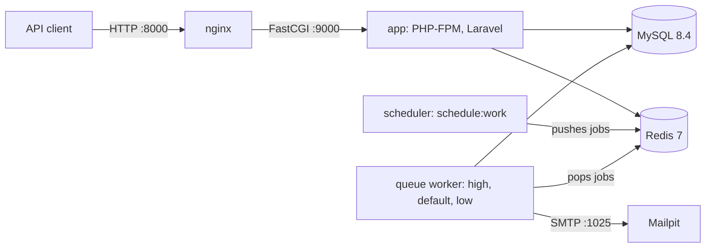
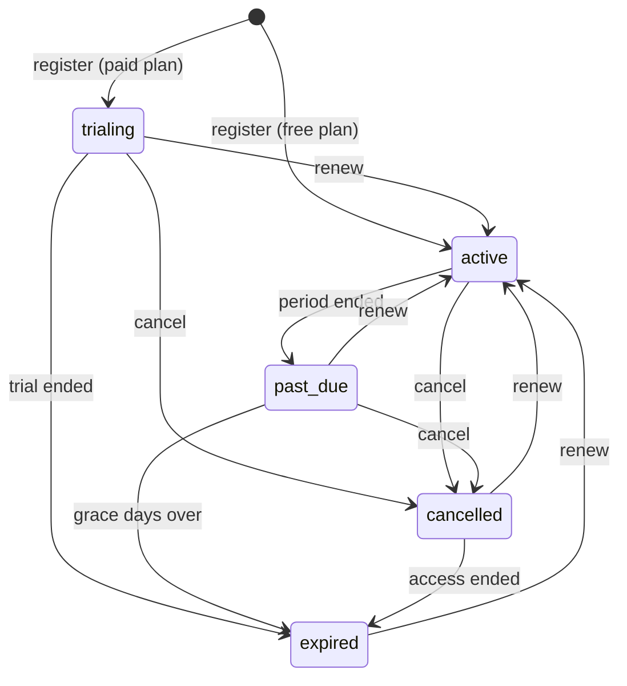

# System design and key technical decisions

## Components



| Container | Role |
|---|---|
| `nginx` | Serves `public/` and passes PHP requests to `app:9000` |
| `app` | PHP-FPM running the Laravel API |
| `queue` | `queue:work redis --queue=high,default,low --tries=3` |
| `scheduler` | `schedule:work`: pushes the hourly and daily jobs onto the queue |
| `mysql` | Application database `saas` and test database `saas_testing` |
| `redis` | Cache (database 1), queues (database 0), rate-limit counters |
| `mailpit` | Catches every outgoing email. Web UI on port 8025 |

`app`, `queue`, and `scheduler` start only after MySQL and Redis pass their health checks.

## Request lifecycle

```
Request
  -> auth:sanctum                     who is the user (token lookup)
  -> SetTenantContext                 company from user.tenant_id; sets the spatie team ID
  -> EnsureTenantIsActive             403 TENANT_SUSPENDED
  -> throttle:api                     plan-based limit, keyed by user
  -> EnsureSubscriptionAllowsWrites   402 on POST/PATCH/DELETE when the subscription is not usable
  -> EnsureFeatureEnabled             403 when the plan lacks a feature (exports)
  -> Controller -> Service -> Repository
  -> after commit: events -> listeners
```

`SetTenantContext` and `EnsureTenantIsActive` are placed before the Redis throttle in Laravel's middleware priority list. The plan-based rate limiter reads the company, so it must run after the company is known. `RateLimitTest` proves the order: a Free user gets `X-RateLimit-Limit: 60` and a Pro user gets `600`.

## Multi-tenancy

All companies share one database. Rows carry `tenant_id`. The design decisions are in [database.md](database.md).

1. **The company comes only from the logged-in user.** `SetTenantContext` reads `auth()->user()->tenant_id` and stores the company in `TenantContext`, a scoped service. No request field, header, or subdomain can choose the company. A `tenant_id` sent in a request body is ignored (`TenantIsolationTest`).
2. **A global scope filters every query.** `BelongsToTenant` adds `TenantScope` to `Customer`, `CustomerExport`, `Subscription`, `SubscriptionEvent`, and `DailyUsageSnapshot`. It also sets `tenant_id` on create. A query with no company set throws `TenantContextMissing`, because a query without a company is a bug and should fail loudly.
3. **Another company's record is a 404, never a 403.** A 403 would confirm that the record exists.
4. **Policies check `tenant_id` again** as a second line of defense.

**The `User` exception.** `User` has no global scope. Sanctum resolves the token's user before any company is known, and login looks a user up by email across all companies, so a throwing scope would break both. The replacement rules are:

- Every company-facing user query is in `UserRepository` and adds `where('tenant_id', ...)` explicitly.
- `User::resolveRouteBinding()` adds the same filter, so `/users/{ulid}` from another company returns 404.
- `TenantIsolationTest` covers user show, update, and delete across companies.

**Platform admins** have no company. They use separate `/admin` routes. Company routes return 403 to them, and admin routes return 403 to company users. Admin code reads across companies only through repository methods named `...AcrossTenants`. For one company's numbers, it runs the normal tenant-scoped code inside `TenantContext::run($tenant, ...)`.

## Plan limits and the concurrency guard

A limit check is a read followed by a write: count the users, then insert one. Two parallel requests could both read 4 of 5 and both insert, which gives 6 of 5. So every create runs this sequence in one transaction:

```php
DB::transaction(function () use ($data) {
    $tenant = $this->tenants->findLocked($this->context->id());      // SELECT ... FOR UPDATE on the company row
    $this->features->ensureWithinLimit($tenant, FeatureKey::MaxUsers, $this->usage->userCount());
    $user = $this->users->create([...]);                              // insert
});                                                                   // commit releases the lock
```

The second request waits at `SELECT ... FOR UPDATE` until the first commits, then counts 5 and gets `403 PLAN_LIMIT_EXCEEDED`. The lock is on one company row, so it serializes only that company's creates. Other companies never wait. The same lock guards the last-owner rule when roles change.

Real parallel requests are hard to run inside Pest, so this is checked by hand. With a Starter company at 4 of 5 users:

```bash
seq 5 | xargs -P5 -I{} curl -s -o /dev/null -w "%{http_code}\n" \
  -H "Authorization: Bearer $TOKEN" -H "Accept: application/json" \
  -d "name=U{}&email=u{}@test.test&role=member" http://localhost:8000/api/v1/users
```

On the Docker stack this printed one `201` and four `403`.

## Subscription state machine



`SubscriptionStatus::canTransitionTo()` holds this table. Anything else returns `409 INVALID_SUBSCRIPTION_TRANSITION`. `SubscriptionService` is the only code that changes a status. Every change locks the subscription row, writes a `subscription_events` row, and dispatches `SubscriptionChanged`.

A plan switch that keeps the status (Starter to Pro, both `active`) is not a status transition. A paid plan never runs without a period, so moving from Free to a paid plan always goes through `renew`. Writes are allowed while `trialing` (before `trial_ends_at`), `active`, `past_due`, or `cancelled` (before `ends_at`). An `expired` company can still read its data and renew.

## Background jobs

| Job or queued listener | Queue | Trigger | Tries | Backoff |
|---|---|---|---|---|
| `SendWelcomeEmail` | high | `TenantRegistered` | 3 | 10s, 60s |
| `SendSetPasswordEmail` | high | `UserCreated` | 3 | 10s, 60s |
| `ExportCustomersJob` | low | `POST /customers/exports` | 3 | 30s, 120s, timeout 300s |
| `ProcessSubscriptionLifecycleJob` | default | Scheduler, hourly | 1 | |
| `TakeDailyUsageSnapshotsJob` | default | Scheduler, daily at 00:15 UTC | 1 | |

- **Priorities.** The worker drains `high` (emails people wait for) before `default` before `low` (exports).
- **Thin jobs.** A job gets IDs, not models, and calls one service method. The service loads the company and works inside `TenantContext::run()`. All logic is tested without a queue.
- **Idempotent.** A completed export is left alone. The lifecycle job re-checks every subscription after taking its row lock, so a second or overlapping run changes nothing. The snapshot job upserts on `(tenant_id, snapshot_date)`. Both scheduled jobs also use `withoutOverlapping()`.
- **Failure.** When an export fails for the last time, `failed()` stores `Export failed. Please try again.` on the export row. The exception goes to the log and `failed_jobs`, never to the client.

## Rate limiting

| Limiter | Limit | Key | Applied to |
|---|---|---|---|
| `auth` | 5 per minute, and 20 per minute | lowercased email + IP; and IP alone | register, login, forgot and reset password |
| `public` | 60 per minute | IP | `GET /plans` |
| `api` | Plan's `api_rate_per_minute`: Free 60, Starter 120, Pro 600. Platform admin 1000 | user | company and admin routes |
| `exports` | 5 per hour | company | `POST /customers/exports` |

All limiters use Redis directly. The `api` limiter reads the plan through the cached `FeatureGate`, so it adds no database query per request. A 429 uses the standard error shape with `RATE_LIMITED` and keeps the `Retry-After` and `X-RateLimit-*` headers.

**Two auth limits.** The email + IP limit stops guessing one account's password. The IP limit stops one client from trying a password against many emails. A per-email limit across all IPs was not added, because an attacker could then lock a real user out on purpose.

**Per user, not per company.** The `api` key is the user, so one busy user or a runaway script cannot lock out the rest of the team. The cost is that a company with many users can send more in total than its plan's number. A company-wide limit would close that gap, but one user could then block everyone. For an internal team tool, I chose fairness between users. The export limit is per company, because exports are the expensive operation.

## Security summary

- **Tokens.** Sanctum personal access tokens are stored hashed and expire after 7 days. Logout deletes the current token. Deactivating or deleting a user, suspending a company, or resetting a password deletes the user's tokens. A token of an inactive user is also rejected on every request, which closes the moment between a deactivation check and the token revocation.
- **Passwords.** Laravel's default hasher (bcrypt), 8 to 72 characters: bcrypt ignores bytes after 72, so longer passwords are rejected instead of silently cut. New users never receive a password; they set their own with a single-use broker token sent by email.
- **No account enumeration.** Unknown email, wrong password, and inactive user return the same `401 INVALID_CREDENTIALS`, and take the same time: when no user matches, the password is still checked against a dummy bcrypt hash. Forgot-password always returns 202, and its lookup and email run after the response is sent, so timing does not reveal the answer either.
- **Brute force.** Auth endpoints allow 5 attempts per minute per email and IP, and 20 per minute per IP.
- **No guessable IDs.** Only ULIDs appear in URLs and JSON. Numeric IDs and `tenant_id` never leave the server.
- **Cross-company access** returns 404, so it reveals nothing about other companies.
- **Input.** Sort fields and filter keys are allowlisted, and unknown keys return 422. Search terms are escaped before `LIKE`. No raw SQL takes user input. Numbers are capped to their column size, so oversized input returns 422, not a 500.
- **Mass assignment.** Every model has an explicit `$fillable`. `tenant_id` comes from the context, and `is_platform_admin` is not fillable.
- **Email content.** Emails are plain HTML Blade views. Every value is escaped and no Markdown is parsed, so a user or company name cannot inject a link into an email.
- **CSV formula injection.** Export cells that start with `=`, `+`, `-`, `@`, a tab, or a carriage return get a leading `'`, so a spreadsheet shows them as text.
- **HTTP hardening.** nginx runs only `public/index.php`, hides the nginx and PHP versions, and sends `X-Content-Type-Options: nosniff`, `X-Frame-Options: DENY`, and `Referrer-Policy: no-referrer`. The root URL serves nothing, so there are no web sessions or cookies.
- **CORS** allows any origin. That is safe here because the API takes Bearer tokens only, never cookies, so a browser on another site has no credentials to send.
- **Containers.** No container process runs as root. The PHP containers run as `app` (uid 1000, so files they write in the mounted project folder belong to the usual first Linux user), nginx uses the unprivileged image as uid 101 on port 8080, MySQL and Redis run as uid 999, and Mailpit as `nobody`.
- **Network.** MySQL, Redis, and PHP-FPM are not published to the host at all; only nginx (port 8000) and Mailpit are. Mailpit listens on 127.0.0.1 only, because it shows every email, including password tokens, so it must not be reachable from the network.
- **Errors.** With `APP_DEBUG=false`, a 500 returns `SERVER_ERROR` with a generic message and no stack trace. `.env.example` is for local development (`APP_DEBUG=true`, simple database password); a production `.env` must set `APP_ENV=production`, `APP_DEBUG=false`, and real secrets.

## Scaling path

1. **Stateless app nodes.** The app keeps no state on disk except export files: sessions are not used, and cache, queues, and rate limits live in Redis. More `app` containers behind a load balancer scale reads and writes. Export files move to S3 by changing the disk.
2. **Read replicas for dashboards.** Dashboards and admin reports are read-only and cached. They can read from a MySQL replica.
3. **Separate Redis for cache and queues.** A cache under memory pressure can evict keys. A queue must never lose a job, so each gets its own instance.
4. **More workers per queue.** Run extra workers for `low` when exports grow, without slowing emails on `high`.
5. **A large company in its own database.** Because the company is resolved in one place, one very large company can be moved to a dedicated database.

## Key decisions

| Decision | Alternatives considered | Reason |
|---|---|---|
| Shared database with `tenant_id` | Database per company; schema per company | One migration path, cheap signups, simple platform reporting. Isolation is enforced by a scope, policies, and tests |
| Company from the logged-in user | Subdomain; `X-Tenant` header | A user belongs to one company, so the user already identifies it. Nothing for a client to forge |
| Hand-written global scope | stancl/tenancy and similar packages | About 100 lines in three small classes that can be read and explained in full. The packages solve multi-database tenancy, which is not needed here |
| spatie/laravel-permission in teams mode | Role column on `users`; custom tables | Roles per company with a well-tested package. One set of three roles serves every company |
| Platform admin as a boolean flag | An admin role in a special team | An admin has no company, so a company-scoped role does not fit |
| Controller, service, repository | Action classes; domain folders | Familiar, fewer files, and enough separation for 35 endpoints |
| Row lock on the company for limits | Unique counters; optimistic retries | Simple, correct under concurrency, and limited to one company |
| Versioned cache keys | Cache tags; deleting known keys | O(1) invalidation and no tag sets to maintain |
| One subscription row plus an event log | Insert a row per plan change | The current state is one indexed lookup. History is append-only |
| No payment gateway, a `renew` stub | Stripe test mode | Out of scope for the assignment. The state machine is ready for real webhooks |
| Downgrade allowed over a limit | Block the downgrade | Nothing is deleted. New additions are blocked, and `over_limit` shows the problem |

